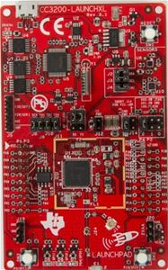
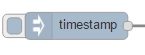
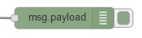
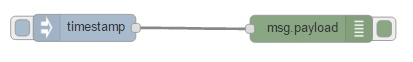
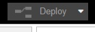
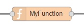
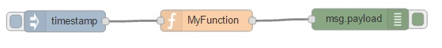
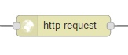
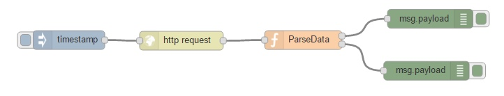
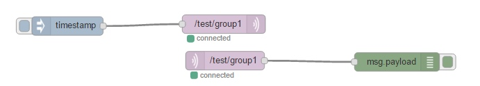

## Introduction 
In this lesson we will discuss about a complete Internet of Things solutions in a lab enviroment.

Source code and this presentation is available on GitHub at the address:

<center>[https://github.com/valerio-vaccaro/IoT_Introduction](https://github.com/valerio-vaccaro/IoT_Introduction)</center>

This presentation and all software used is Open Source (and if you want you can contribute to the development of this lesson!).

## Our testbed 
Based on open source/open hardware solutions in this lesson we will use:

- 6 WIFI board CC3200-LAUNCHXL
- a common MQTT broker for messages 
- 6 istances of NodeRED  
- an instance of R Studio Server with 6 users

## CC3200 - Hardware
Based on open source/open hardware solutions:
<div class="columns-2">
  <center></center>
  
  - embedded board with a powerful SoC with WIFI capabilities
  - embedded sensors (2xTemperature, 3 axis accelerometer)
  - low price $29.99  
</div>

<center>[https://store.ti.com/cc3200-launchxl.aspx](https://store.ti.com/cc3200-launchxl.aspx)</center>

## CC3200 - Firmware
Every board can be can be programmed in C using the Energia open source software, the firmware provided in this lesson is customized for send and receive messages using the MQTT protocol and work 

- every second send a message on the topic iot/CC3200/_MAC address_/data
- if receive a message on topic iot/CC3200/_MAC address_/command (ON/OFF messages turn on or off the red led)

 <center></center>

## MQTT

MQTT (formerly MQ Telemetry Transport) is a publish-subscribe based "light weight" messaging protocol for use on top of the TCP/IP protocol. 

It is designed for connections with remote locations where a "small code footprint" is required or the network bandwidth is limited. The publish-subscribe messaging pattern requires a message broker. 

The broker is responsible for distributing messages to interested clients based on the topic of a message. 

In our setup we use RabbitMQ broker with MQTT plugin.


## NodeRED
Node-RED is a open source visual tool for wiring the Internet of Things developed by IBM Emerging Technology and the community.

<center> </center>

## Groups
| Group | NodeRed URL                | R URL                                 | MAC          | Barcode   |
|-------|----------------------------|---------------------------------------|--------------|-----------|
|  1    | http://10.0.1.64:8001/red/ | http://10.0.1.64:8787 - group1/group1 | f4b85e087366 | NB4001391 |
|  2    | http://10.0.1.64:8002/red/ | http://10.0.1.64:8787 - group2/group2 | f4b85e0884f7 | NB4001338 |
|  3    | http://10.0.1.64:8003/red/ | http://10.0.1.64:8787 - group3/group3 | d4f51303fc29 | NB5005292 |
|  4    | http://10.0.1.64:8004/red/ | http://10.0.1.64:8787 - group4/group4 | f4b85e089dbc | NB4001278 |
|  5    | http://10.0.1.64:8005/red/ | http://10.0.1.64:8787 - group5/group5 | f4b85e087359 | NB4001323 |
|  6    | http://10.0.1.64:8006/red/ | http://10.0.1.64:8787 - group6/group6 | d4f51303f8a2 | NB6000140 |

## NodeRED - Exercise 1 - Add an Inject node 
In the tab "Lesson 1" on NodeRED you can find the code.

The Inject node allows you to inject messages into a flow, either by clicking the button on the node, or setting a time interval between injects.

Drag one onto the workspace from the palette.

 <center></center>

Open the sidebar (Ctrl-Space, or via the dropdown menu) and select the Info tab.

Select the newly added Inject node to see information about its properties and a description of what it does.

## NodeRED -  Exercise 1 - Add a Debug node

The Debug node causes any message to be displayed in the Debug sidebar. By default, it just displays the payload of the message, but it is possible to display the entire message object.

 <center></center>

## NodeRED - Exercise 1 - Wire the two together ans deploy

Connect the Inject and Debug nodes together by dragging between the output port of one to the input port of the other.

 <center></center>

At this point, the nodes only exist in the editor and must be deployed to the server.

Click the Deploy button. Simple as that.

<center></center>

With the Debug sidebar tab selected, click the Inject button. You should see numbers appear in the sidebar. By default, the Inject node uses the number of milliseconds since January 1st, 1970 as its payload. Let’s do something more useful with that.

## NodeRED - Exercise 1 -  Add a Function node

The Function node allows you to pass each message though a JavaScript function.

 <center></center>

Double-click on the Function node to bring up the edit dialog. Copy the follow code into the function field:
```{}
// Create a Date object from the payload
var date = new Date(msg.payload);
// Change the payload to be a formatted Date string
msg.payload = date.toString();
// Return the message so it can be sent on
return msg;
```

## NodeRED - Exercise 1 - Deploy

Click Ok to close the edit dialog and then click the deploy button.

<center></center>
 
Now when you click the Inject button, the messages in the sidebar will be more readable time stamps.

## NodeRED - Exercise 2
This example is slightly more complex and starts to bring in data from external sources to do something useful locally.

It will go out to an external web site

* grab some information
* read and convert that into a useful form
* output that in two formats, one as a JSON object for further use, and one as a boolean to switch things on and off

## NodeRED - Exercise 2 - Add an Inject node

In the previous example, the Inject node was used to trigger the flow when its button was clicked. For this example, the Inject node will be configured to trigger the flow at a regular interval.

Drag an Inject node onto the workspace from the palette.

<center></center>

Double click the node to bring up the edit dialog. Set the repeat interval to every 5 minutes on every day.

Click Ok to close the dialog.

## NodeRED - Exercise 2 - Add an HttpRequest node

The HttpRequest node can be used to retrieve a web-page when triggered.

<center></center>
 
After adding one to the workspace, edit it to set the URL property to:
```
http://realtimeweb-prod.nationalgrid.com/SystemData.aspx
```
You can optionally add a friendly name.

## NodeRED - Exercise 2 - Add a function node

Add a Function node with the following code:
```{}
// does a simple text extract parse of the http output to provide an
// object containing the uk power demand, frequency and time
if (~msg.payload.indexOf('<span')) {
    var dem = msg.payload.split('Demand:')[1].split("MW")[0];
    var fre = msg.payload.split('Frequency:')[1].split("Hz")[0];
    msg.payload = {};
    msg.payload.demand = parseInt(dem.split(">")[1].split("<")[0]);
    msg.payload.frequency = parseFloat(fre.split(">")[1].split("<")[0]);
    msg2 = {};
    msg2.payload = (msg.payload.frequency >= 50) ? true : false;
    return [msg,msg2];
}
return null;
```

Set the number of outputs for the function node to 2.

## NodeRED - Exercise 2 - Add a Debug node and wire them all together

Add two Debug nodes.

Wire the Inject node output to the HttpRequest node input.

Wire the HttpRequest node output to the Function node input.

Wire each of the Function node outputs to a different Debug node input.

<center></center>

## NodeRED - Exercise 2 -  Deploy

At this point, the nodes only exist in the editor and must be deployed to the server.

Click the Deploy button.

With the Debug sidebar tab selected (Ctrl-Space, or via the dropdown menu, then click the Debug tab), click the Inject button. You should see an entry with some contents that looks like:

```(Object) { "demand": 34819, "frequency": 50.04 }```

and another with something like:

```(boolean) true```

## NodeRED - Exercise 2 - Summary

You now have a flow that goes to the Internet - gets the live UK total electricity consumption - and converts it into a JavaScript object with demand in MW, and frequency in Hertz.

The object is emitted out of the first output of the Function node.

The frequency is an indication of overall stress - so when the frequency is under 50 HZ there may be excess load on the overall National Grid. This is indicated in the message emitted out of the second output of the Function node; if the payload is true, there is capacity in the grid.

## NodeRED - Exercise 3 - MQTT

It's time to introduce MQTT nodes, they allow to receive and send messages to the configured MQTT broker.

<center></center>
 
 Try to:
 
* send and receive a message to the topic /test/group1 (you need to check and add only wires)
* send and receive a message to the group /test/all

## NodeRED - Exercise 4 - Receive data from CC3200
In the tab "Lesson 2" on NodeRED you can find the code.

Modify the code as follow:

- analize the object returned after the json node
- extract the value TempObj and create a new message with only this value in the payload 
- if payload is > 30 then modify the payload in OFF
- if payload is <= 30 then modify the payload in ON
- send the generate message to the board on command queue

In the tab "Lesson 3" you can find all the code we are using for save all the information received from the board. Don't modify the code in this tab!

## Big Data or Data Science???

 <center></center>
 
## Probabilistic approach
 <center></center>
 
How we can alainze a big amount of data and find out the models? We can use a special software for doing some statistical analysis.

## R
R is a language and environment for statistical computing and graphics and  provides a wide variety of statistical (linear and nonlinear modelling, classical statistical tests, time-series analysis, classification, clustering, …) and graphical techniques, and is highly extensible. 

Why choose R? Because R ...

- is "a powerful software environment for statistical computing and graphics."
- is Open Source (so it's completely free!)
- is incredibly modular
- has a large development community s)
- uses scripts, which can help with replication/validation
- can be used with different IDEs (RConsole, RStudio, JGR, etc...)

## R - Example - Receive data
Connect to http://10.0.1.64:8787 ang log-in with provided username/password. 

In the platform you can find out some scripts added for analize the data collected from the CC3200 boards, for example you can load the dataset with the following script

```{R}
# example for group 1, change URL using your group number
data <- read.csv("http://10.0.1.64:8001/api/dataset", header = FALSE)
names(data) <- c("Timestamp", "Board", "Temp", "TempObj",
                 "X", "Y", "Z", "RSSI", "Button1", "Button2")
# convert timestamp from Epoch to a POSIXct object
data$Timestamp <- as.POSIXct(data$Timestamp/1000,origin =
                                     "1970-01-01",tz = "CET")
# add column with hour
data$Hour <-  as.POSIXlt(data$Timestamp)$hour 

```

   Or opening the file 1.1.load.R and try to analize the data using the command summary(data) on R.

## R - Example - Plot temperature
Plotting is the first activity you can do on clean data, you can use the ggplot2 library for do a first data analysis.

```{R}
library(ggplot2)

g <- ggplot(data=data, aes(x=Timestamp)) + 
  geom_line(aes(y=Temp, color="air temperature")) + 
  geom_line(aes(y=TempObj, color="object temperature"))

h <- ggplot(data=data, aes(Temp)) +
        geom_histogram() 
```

More examples are present in the file 1.2.plot.R

## R - Example - Plot temperature - Values

```{R, echo=FALSE, cache=FALSE, results=FALSE, warning=FALSE, comment=FALSE, warning=FALSE, message=FALSE}
g 
```

## R - Example - Plot temperature - Histogram

```{R, echo=FALSE, cache=FALSE, results=FALSE, warning=FALSE, comment=FALSE, warning=FALSE, message=FALSE}
h
```

## R - Example - Questions
Open the file 1.2.load.R and try to answer the following questions:

- How we can plot TempObj?
- How we can plot the difference between Temp and TempObj? What distribution remember this plot?
- How we can compare temperature at different hours?
- How we can rapresent accelerometer informations?

Open the file 1.3.model.R and try to answer the following questions:

- Can we describe Temp in terms of TempObj based on data recorded? Can we use a linear model?
- RSSI has an impact on Temp?

## Questions & Answers
 <center></center>