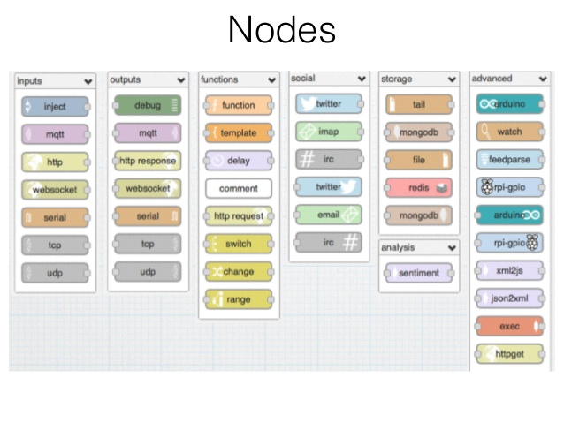

## Introduction 

This is an R Markdown presentation. Markdown is a simple formatting syntax for authoring HTML, PDF, and MS Word documents. For more details on using R Markdown see <http://rmarkdown.rstudio.com>.

When you click the **Knit** button a document will be generated that includes both content as well as the output of any embedded R code chunks within the document.

## IoT Ecosystem

- Bullet 1
- Bullet 2
- Bullet 3

## Our testbed 

Based on open source/open hardware solutions:

- every node CC3200
- MQTT Broker
- NodeRED 
- R Studio Server for data analysis 

## CC3200

Based on open source/open hardware solutions:
<div class="columns-2">
  

  - embedded 
  - embedded sensors (2xTemperature, 3 axis accelerometer)
  - take care
  - $29.99
</div>

[](https://store.ti.com/cc3200-launchxl.aspx)

## MQTT

## NodeRED
Node-RED is a tool for wiring together hardware devices, APIs and online services in new and interesting ways.


## NodeRED - Add an Inject node 
The Inject node allows you to inject messages into a flow, either by clicking the button on the node, or setting a time interval between injects.

Drag one onto the workspace from the palette.

Open the sidebar (Ctrl-Space, or via the dropdown menu) and select the Info tab.

Select the newly added Inject node to see information about its properties and a description of what it does.

## NodeRED - Add a Debug node

The Debug node causes any message to be displayed in the Debug sidebar. By default, it just displays the payload of the message, but it is possible to display the entire message object.

## NodeRED - Wire the two together

Connect the Inject and Debug nodes together by dragging between the output port of one to the input port of the other.

## NodeRED - Deploy

At this point, the nodes only exist in the editor and must be deployed to the server.

Click the Deploy button. Simple as that.

With the Debug sidebar tab selected, click the Inject button. You should see numbers appear in the sidebar. By default, the Inject node uses the number of milliseconds since January 1st, 1970 as its payload. Let’s do something more useful with that.

## NodeRED -  Add a Function node

The Function node allows you to pass each message though a JavaScript function.

Wire the Function node inbetween the Inject and Debug nodes. You’ll need to delete the existing wire (select it and hit delete on the keyboard).

Double-click on the Function node to bring up the edit dialog. Copy the follow code into the function field:
```{}
// Create a Date object from the payload
var date = new Date(msg.payload);
// Change the payload to be a formatted Date string
msg.payload = date.toString();
// Return the message so it can be sent on
return msg;
```

## NodeRED - Deploy

Click Ok to close the edit dialog and then click the deploy button.

Now when you click the Inject button, the messages in the sidebar will be more readable time stamps.

## Exercize 
Open 

## R
R is a free software environment for statistical computing and graphics. 

## Exercize 
Open

