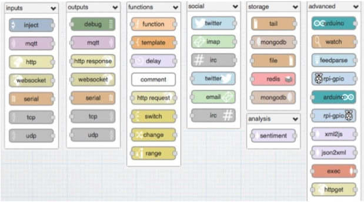

## Introduction 
In this lesson we well discover 

Source code and this presentation is available on GitHub at the address

[https://github.com/valerio-vaccaro/IoT_Introduction](https://github.com/valerio-vaccaro/IoT_Introduction)

All software used is open source!


## IoT Ecosystem
In an IoT ecosystem we have:

- nodes and harware 
- protocols and 
- platform
- analitics and rule 

## Our testbed 
Based on open source/open hardware solutions:

- 6 WIFI board CC3200-LAUNCHXL
- a common MQTT Broker
- 6 istances of NodeRED  
- an instance of R Studio Server with 6 users

## CC3200
Based on open source/open hardware solutions:
<div class="columns-2">
  

  - embedded board with a powerful SoC with WIFI capabilities
  - embedded sensors (2xTemperature, 3 axis accelerometer)
  - take care
  - $29.99 
  - can be programmed in C using the Energia open source software
  [https://store.ti.com/cc3200-launchxl.aspx](https://store.ti.com/cc3200-launchxl.aspx)
</div>

[https://store.ti.com/cc3200-launchxl.aspx](https://store.ti.com/cc3200-launchxl.aspx)

## MQTT

## NodeRED
Node-RED is a open source visual tool for wiring the Internet of Things developed by IBM Emerging Technology and the community.



You can reach your nodered istance at the address https://store.ti.com/cc3200-launchxl.aspx where X is the numbero of your group.


## Group

_Group1_
Mac: f4b85e087366 
Barcode:  NB4001391

_Group2_
Mac: f4b85e0884f7
Barcode:  NB4001338

_Group3_
Mac: d4f51303fc29 
Barcode: NB5005292

_Group4_
Mac: f4b85e089dbc
Barcode: NB4001278

_Group5_
Mac: f4b85e087359
Barcode: NB4001323

_Group6_
Mac: d4f51303f8a2
Barcode: NB6000140


## NodeRED - Exercise 1 - Add an Inject node 
The Inject node allows you to inject messages into a flow, either by clicking the button on the node, or setting a time interval between injects.

Drag one onto the workspace from the palette.

 

Open the sidebar (Ctrl-Space, or via the dropdown menu) and select the Info tab.

Select the newly added Inject node to see information about its properties and a description of what it does.

## NodeRED -  Exercise 1 - Add a Debug node

The Debug node causes any message to be displayed in the Debug sidebar. By default, it just displays the payload of the message, but it is possible to display the entire message object.

 

## NodeRED - Exercise 1 - Wire the two together ans deploy

Connect the Inject and Debug nodes together by dragging between the output port of one to the input port of the other.

 

At this point, the nodes only exist in the editor and must be deployed to the server.

Click the Deploy button. Simple as that.

 

With the Debug sidebar tab selected, click the Inject button. You should see numbers appear in the sidebar. By default, the Inject node uses the number of milliseconds since January 1st, 1970 as its payload. Let’s do something more useful with that.

## NodeRED - Exercise 1 -  Add a Function node

The Function node allows you to pass each message though a JavaScript function.

 

Double-click on the Function node to bring up the edit dialog. Copy the follow code into the function field:
```{}
// Create a Date object from the payload
var date = new Date(msg.payload);
// Change the payload to be a formatted Date string
msg.payload = date.toString();
// Return the message so it can be sent on
return msg;
```

## NodeRED - Exercise 1 - Deploy

Click Ok to close the edit dialog and then click the deploy button.

 
 
Now when you click the Inject button, the messages in the sidebar will be more readable time stamps.

## NodeRED - Exercise 2
This example is slightly more complex and starts to bring in data from external sources to do something useful locally.

It will go out to an external web site

* grab some information
* read and convert that into a useful form
* output that in two formats, one as a JSON object for further use, and one as a boolean to switch things on and off

## NodeRED - Exercise 2 - Add an Inject node

In the previous example, the Inject node was used to trigger the flow when its button was clicked. For this example, the Inject node will be configured to trigger the flow at a regular interval.

Drag an Inject node onto the workspace from the palette.

 

Double click the node to bring up the edit dialog. Set the repeat interval to every 5 minutes on every day.

Click Ok to close the dialog.

## NodeRED - Exercise 2 - Add an HttpRequest node

The HttpRequest node can be used to retrieve a web-page when triggered.

 
 
After adding one to the workspace, edit it to set the URL property to:
```
http://realtimeweb-prod.nationalgrid.com/SystemData.aspx
```
You can optionally add a friendly name.

## NodeRED - Exercise 2 - Add a function node

Add a Function node with the following code:
```{}
// does a simple text extract parse of the http output to provide an
// object containing the uk power demand, frequency and time
if (~msg.payload.indexOf('<span')) {
    var dem = msg.payload.split('Demand:')[1].split("MW")[0];
    var fre = msg.payload.split('Frequency:')[1].split("Hz")[0];
    msg.payload = {};
    msg.payload.demand = parseInt(dem.split(">")[1].split("<")[0]);
    msg.payload.frequency = parseFloat(fre.split(">")[1].split("<")[0]);
    msg2 = {};
    msg2.payload = (msg.payload.frequency >= 50) ? true : false;
    return [msg,msg2];
}
return null;
```

Set the number of outputs for the function node to 2.

## NodeRED - Exercise 2 - Add a Debug node and wire them all together

Add two Debug nodes.

Wire the Inject node output to the HttpRequest node input.

Wire the HttpRequest node output to the Function node input.

Wire each of the Function node outputs to a different Debug node input.

 

## NodeRED - Exercise 2 -  Deploy

At this point, the nodes only exist in the editor and must be deployed to the server.

Click the Deploy button.

With the Debug sidebar tab selected (Ctrl-Space, or via the dropdown menu, then click the Debug tab), click the Inject button. You should see an entry with some contents that looks like:

```(Object) { "demand": 34819, "frequency": 50.04 }```

and another with something like:

```{}(boolean) true``

## NodeRED - Exercise 2 - Summary

You now have a flow that goes to the Internet - gets the live UK total electricity consumption - and converts it into a JavaScript object with demand in MW, and frequency in Hertz.

The object is emitted out of the first output of the Function node.

The frequency is an indication of overall stress - so when the frequency is under 50 HZ there may be excess load on the overall National Grid. This is indicated in the message emitted out of the second output of the Function node; if the payload is true, there is capacity in the grid.

## NodeRED - Exercise 3 - MQTT

Play freely with MQTT Nodes.

 
 
 Try to:
 
* send and receive a message to the topic /test/group1 (you need to check and add only wires)
* send and receive a message to the group /test/all

## Big Data or Data Science???

 

## R
R is a free software environment for statistical computing and graphics. 

 
## demo
We are collecting all information from the boards 

